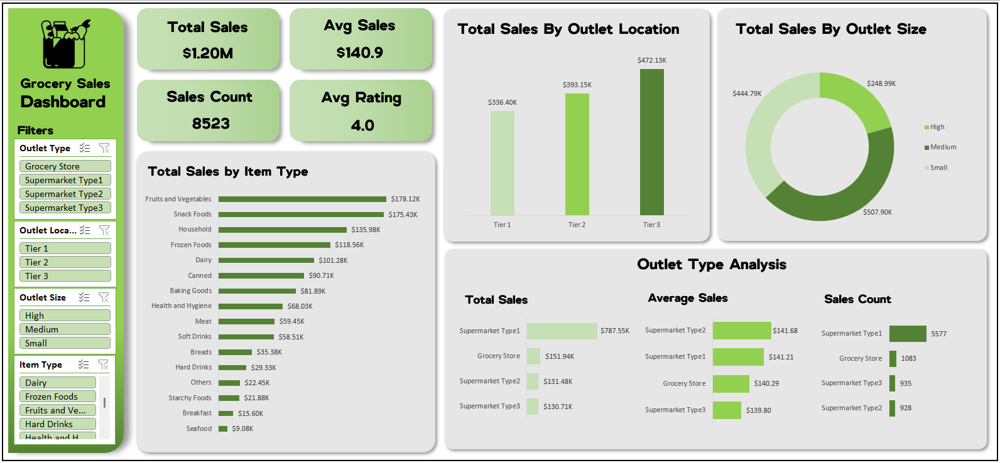
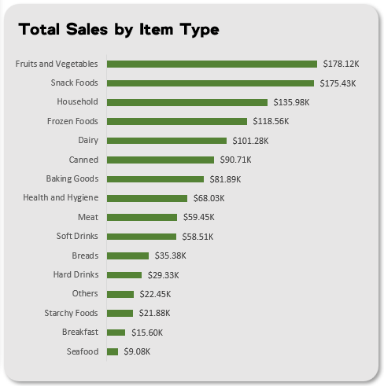
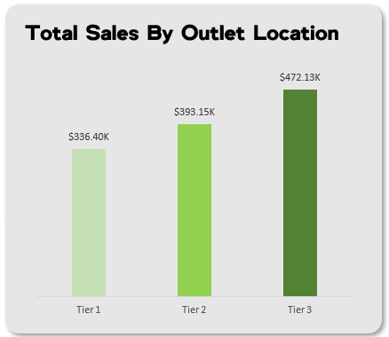
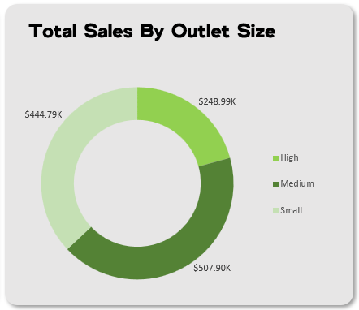
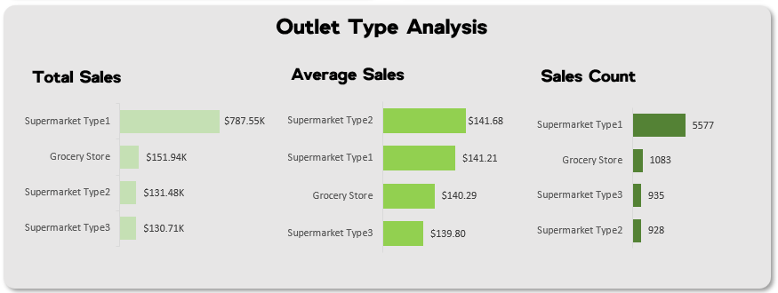

# Multi-Outlet Retail Sales Analytics Dashboard

This project analyzes sales data from a fictional multi-outlet retail company operating in the **grocery and FMCG sector**. The organization sells a wide range of everyday consumer items such as fruits, vegetables, household goods, snack foods, and beverages across different outlet types and locations.

As a **Data Analyst** at this company, my goal was to evaluate overall sales performance, understand which product categories drive the most revenue, and compare performance across outlet types, sizes, and city tiers. The dataset contained **8,500+ rows** of transaction data covering a **single operational year**, allowing for detailed categorical insights. 

The insights and recommendations are provided on the following key areas:
- Item Type Performance
- Sales by Outlet Location
- Sales by Outlet Size
- Sales by Outlet Type

---

## Data Structure & Initial Checks  

The dataset was provided as a **single flat table with ~8.5K rows**. Key fields include: 
- Item Identifier  
- Item Type  
- Outlet Identifier  
- Outlet Location Type  
- Outlet Size  
- Outlet Type
- Sales
- Rating  

Initial checks included:
- Missing value identification
- Data type consistency
- Creating pivot tables for categorical splits

Since there was **no relational structure, no ERD** was required.

---

## Executive Summary  

### Key Findings  
The analysis reveals clear differences in performance across **item types, outlet formats, and outlet sizes**. **Fruits & Vegetables, Snack Foods, and Household items** are the major revenue generators. **Medium-sized outlets and Tier 3 locations** outperform others. Among outlet types, **Supermarket Type 1** dominates overall sales volume, while **Supermarket Type 2** leads in average sales per transaction.

### Key KPIs
- **Total Sales:** $1.20M
- **Average Sales:** $140.9
- **Items Sold:** 8,523
- **Average Rating:** 4.0

**Dashboard Preview**

  

---

## Insights Deep Dive  

### 1. Item Type Performance  
- **Fruits & Vegetables** contribute the most to total sales, generating **$178.12K**, highlighting their importance as high-demand essentials.
- **Snack Foods** follow closely with **$175.43K**, likely driven by frequent customer purchases and higher margins.
- **Household products** contribute **$135.98K**, making them the third most significant category.
- **Seafood** performs the weakest with only **$9.08K** in total sales, suggesting low demand or inconsistent availability.

  

 
---

### 2. Sales by Outlet Location
- **Tier 3** outlets outperform all others with **$472.13K**, indicating strong sales in **densely populated or high-traffic regions**.
- **Tier 2** outlets contribute **$393.15K**, showing stable but moderate revenue across **mid-sized cities**.
- **Tier 1** outlets contribute **$336.40K**, marking them as the lowest among the three tiers.
- The revenue gap between **Tier 1 and Tier 3** suggests a need for **targeted marketing or inventory adjustments** in **Tier 1 cities**.

  

---

### 3. Sales by Outlet Size
- **Medium-sized outlets** dominate with **$507.90K**, indicating **optimal capacity and customer engagement**.
- **Low-sized outlets** generate **$444.79K**, despite their smaller footprint.
- **High-sized outlets** contribute **$248.99K**, **underperforming** compared to their **smaller counterparts**.
- This pattern reveals that **outlet size doesn’t directly correlate with sales**, **operational strategy and location** matter more.

---

### 4. Sales by Outlet Type
- **Supermarket Type 1** is the strongest performer with **$787.55K** in total sales and **5,577** items sold.
- **Supermarket Type 2** has the highest average sales amount at **$141.68**, indicating **better pricing or product mix**.
- **Supermarket Type 3** is the weakest revenue generator at **$130.71K** and has the lowest average sales at **$139.80**.
- **Supermarket Type 2** sells the fewest items **(928)**, showing **fewer transactions but higher value per transaction**.

  

---

## Recommendations  
Based on the analysis, the following actions are recommended:
- **Increase inventory and promotional focus** on Fruits & Vegetables, Snack Foods, and Household items to capitalize on high-performing categories.
- **Reassess outlet strategy** for Tier 1 cities to identify the cause of lower sales — possibly pricing, assortment, or customer reach.
- **Optimize high-sized outlets**, as their low performance suggests underutilized floor space or ineffective merchandising.
- **Support Supermarket Type 3** with targeted marketing or revised product mixes to boost performance.
- **Analyze Supermarket Type 2’s pricing strategy**, as its high average sales may provide insights for improving overall revenue efficiency.

---

## Assumptions & Caveats  
- The dataset contains data from only one year, so no trend or seasonality analysis was possible.
- Prices and sales totals were assumed to be consistent across outlets without regional inflation adjustments.
- Since this was a flat table, no foreign key relationships were analyzed.
